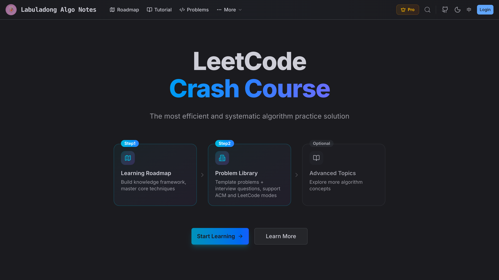

# labuladong Algo Notes

This repository contains 60+ original articles based on LeetCode problems, covering all problem types and techniques. The goal is to help you **think algorithmically** — not just memorize solutions.

When it comes to LeetCode, what matters is not the answer itself, but the **thought process** behind it. A repository full of raw code without explanation isn't very useful. The real value lies in understanding the frameworks and patterns that let you solve new problems on your own.

Most people grind LeetCode to land a job, not to compete in programming contests. So the focus here is on **clarity and practical understanding** — building reusable mental frameworks that make algorithm problems approachable and solvable.

## Before You Start

**1. Give this repo a star** if you find it helpful — it keeps me motivated to write more.

**2. I recommend studying on my website, where each article links to the corresponding LeetCode problems so you can read and practice side by side. The site covers 500+ problems with step-by-step guidance:**

https://labuladong.online/en/algo/

## Table of Contents

* [Introduction](https://labuladong.online/en/algo/home/)

* [Study Plans for Beginners and Quick Mastery](https://labuladong.online/en/algo/menu/plan/)
  * [Fast-Track Learning Plan](https://labuladong.online/en/algo/intro/quick-learning-plan/)
  * [Complete Learning Plan](https://labuladong.online/en/algo/intro/beginner-learning-plan/)
  * [How to Learn Algorithms Efficiently](https://labuladong.online/en/algo/intro/how-to-learn-algorithms/)
  * [How to Practice](https://labuladong.online/en/algo/intro/how-to-practice/)

* [Tools and Algorithm Visualization](https://labuladong.online/en/algo/menu/tools/)
  * [AI Assistant for Questions](https://labuladong.online/en/algo/intro/ai-assistant/)
  * [Algorithm Visualization Introduction](https://labuladong.online/en/algo/intro/visualize/)
  * [Algorithm Game Introduction](https://labuladong.online/en/algo/intro/game/)
  * [Chrome Extension for LeetCode](https://labuladong.online/en/algo/intro/chrome/)
  * [vscode/cursor Plugin for LeetCode](https://labuladong.online/en/algo/intro/vscode/)
  * [JetBrains Plugin for LeetCode](https://labuladong.online/en/algo/intro/jetbrains/)
  * [Subscribe to Pro](https://labuladong.online/en/algo/intro/site-vip/)

* [Programming Language Basics](https://labuladong.online/en/algo/menu/)
  * [Chapter Introduction](https://labuladong.online/en/algo/intro/programming-language-basic/)
  * [C++ Basics](https://labuladong.online/en/algo/programming-language-basic/cpp/)
  * [Java Basics](https://labuladong.online/en/algo/programming-language-basic/java/)
  * [Golang Basics](https://labuladong.online/en/algo/programming-language-basic/golang/)
  * [Python Basics](https://labuladong.online/en/algo/programming-language-basic/python/)
  * [JavaScript Basics](https://labuladong.online/en/algo/intro/js/)
  * [LeetCode Guide](https://labuladong.online/en/algo/intro/leetcode/)
  * [Let's Have Fun with LeetCode](https://labuladong.online/en/algo/programming-language-basic/lc-practice/)
  * [ACM Mode Code Template](https://labuladong.online/en/algo/intro/acm-mode/)

* [Getting Started: Data Structures and Sorting](https://labuladong.online/en/algo/menu/quick-start/)
  * [Chapter Introduction](https://labuladong.online/en/algo/intro/data-structure-basic/)
  * [Basic Time Complexity](https://labuladong.online/en/algo/intro/complexity-basic/)

  * [Implement Dynamic Arrays](https://labuladong.online/en/algo/menu/dynamic-array/)
    * [Array (Sequential Storage)](https://labuladong.online/en/algo/data-structure-basic/array-basic/)
    * [Dynamic Array Code Implementation](https://labuladong.online/en/algo/data-structure-basic/array-implement/)

  * [Implement Single/Double Linked List](https://labuladong.online/en/algo/menu/linked-list/)
    * [Linked List (Chain Storage)](https://labuladong.online/en/algo/data-structure-basic/linkedlist-basic/)
    * [Linked List Code Implementation](https://labuladong.online/en/algo/data-structure-basic/linkedlist-implement/)
    * [Implement Snake Game](https://labuladong.online/en/algo/game/snake/)

  * [Array and LinkedList Variations](https://labuladong.online/en/algo/menu/arr-linked/)
    * [Circular Array Technique and Implementation](https://labuladong.online/en/algo/data-structure-basic/cycle-array/)
    * [Skip List Basics](https://labuladong.online/en/algo/data-structure-basic/skip-list-basic/)
    * [BitMap Principles and Implementation](https://labuladong.online/en/algo/data-structure-basic/bitmap/)

  * [Implement Queue and Stack](https://labuladong.online/en/algo/menu/queue-stack/)
    * [Queue/Stack Basic](https://labuladong.online/en/algo/data-structure-basic/queue-stack-basic/)
    * [Implement Queue/Stack with Linked List](https://labuladong.online/en/algo/data-structure-basic/linked-queue-stack/)
    * [Implement Queue/Stack with Array](https://labuladong.online/en/algo/data-structure-basic/array-queue-stack/)
    * [Deque Implementation](https://labuladong.online/en/algo/data-structure-basic/deque-implement/)

  * [Implement HashMap](https://labuladong.online/en/algo/menu/hash-table/)
    * [Basic Concept of HashMap](https://labuladong.online/en/algo/data-structure-basic/hashmap-basic/)
    * [Implement HashMap with Separate Chaining](https://labuladong.online/en/algo/data-structure-basic/hashtable-chaining/)
    * [Key Points to Implement Linear Probing](https://labuladong.online/en/algo/data-structure-basic/linear-probing-key-point/)
    * [Two Implementations of Linear Probing](https://labuladong.online/en/algo/data-structure-basic/linear-probing-code/)
    * [Hash Set Basic and Implementation](https://labuladong.online/en/algo/data-structure-basic/hash-set/)

  * [Hash Table Variations](https://labuladong.online/en/algo/menu/hash-table-variation/)
    * [Use Linked List to Enhance Hash Table (LinkedHashMap)](https://labuladong.online/en/algo/data-structure-basic/hashtable-with-linked-list/)
    * [Use Array to Enhance Hash Table (ArrayHashMap)](https://labuladong.online/en/algo/data-structure-basic/hashtable-with-array/)
    * [Bloom Filter Implementation](https://labuladong.online/en/algo/data-structure-basic/bloom-filter/)

  * [Binary Tree Structure and Traversal](https://labuladong.online/en/algo/menu/binary-tree/)
    * [Binary Tree Basic and Common Types](https://labuladong.online/en/algo/data-structure-basic/binary-tree-basic/)
    * [Binary Tree Recursive/Level Traversal](https://labuladong.online/en/algo/data-structure-basic/binary-tree-traverse-basic/)
    * [Use cases of DFS and BFS](https://labuladong.online/en/algo/data-structure-basic/use-case-of-dfs-bfs/)
    * [N-ary Tree Recursive/Level Traversal](https://labuladong.online/en/algo/data-structure-basic/n-ary-tree-traverse-basic/)

  * [Binary Tree Variations](https://labuladong.online/en/algo/menu/binary-tree/)
    * [TreeMap Structure and Visualization](https://labuladong.online/en/algo/data-structure-basic/tree-map-basic/)
    * [Red-Black Trees Basics and Visualization](https://labuladong.online/en/algo/data-structure-basic/rbtree-basic/)
    * [Trie, Digital Tree, Prefix Tree Basics and Visualization](https://labuladong.online/en/algo/data-structure-basic/trie-map-basic/)
    * [Basic Concept of Binary Heap](https://labuladong.online/en/algo/data-structure-basic/binary-heap-basic/)
    * [Binary Heap/Priority Queue Code Implementation](https://labuladong.online/en/algo/data-structure-basic/binary-heap-implement/)
    * [Segment Tree Basics and Visualization](https://labuladong.online/en/algo/data-structure-basic/segment-tree-basic/)
    * [Data Compression and Huffman Tree](https://labuladong.online/en/algo/data-structure-basic/huffman-tree/)
    * [Updating](https://labuladong.online/en/algo/intro/updating/)

  * [Graph Structure and Algorithm Overview](https://labuladong.online/en/algo/menu/graph-theory/)
    * [Basic Terminology in Graph Theory](https://labuladong.online/en/algo/data-structure-basic/graph-terminology/)
    * [Graph Structure Code Implementation](https://labuladong.online/en/algo/data-structure-basic/graph-basic/)
    * [Graph Structure DFS/BFS Traversal](https://labuladong.online/en/algo/data-structure-basic/graph-traverse-basic/)
    * [Eulerian Graph and One-Stroke Game](https://labuladong.online/en/algo/data-structure-basic/eulerian-graph/)
    * [Graph Shortest Path Algorithms Overview](https://labuladong.online/en/algo/data-structure-basic/graph-shortest-path/)
    * [Minimum Spanning Tree Algorithms Overview](https://labuladong.online/en/algo/data-structure-basic/graph-minimum-spanning-tree/)
    * [Basic Concept of Union Find Algorithm](https://labuladong.online/en/algo/data-structure-basic/union-find-basic/)
    * [Updating](https://labuladong.online/en/algo/intro/updating/)

  * [Implement and Visualize 10 Sorting Algorithms](https://labuladong.online/en/algo/menu/sorting/)
    * [Chapter Introduction](https://labuladong.online/en/algo/intro/sorting/)
    * [Key Metrics of Sorting Algorithms](https://labuladong.online/en/algo/data-structure-basic/sort-basic/)
    * [Explore Selection Sort in Depth](https://labuladong.online/en/algo/data-structure-basic/select-sort/)
    * [Bubble Sort with Stability](https://labuladong.online/en/algo/data-structure-basic/bubble-sort/)
    * [Insertion Sort with Reverse Thinking](https://labuladong.online/en/algo/data-structure-basic/insertion-sort/)
    * [Shell Sort - Better than O(N^2)](https://labuladong.online/en/algo/data-structure-basic/shell-sort/)
    * [Quick Sort and Binary Tree Preorder](https://labuladong.online/en/algo/data-structure-basic/quick-sort/)
    * [Merge Sort and Binary Tree Postorder](https://labuladong.online/en/algo/data-structure-basic/merge-sort/)
    * [Heap Sort and Binary Heap](https://labuladong.online/en/algo/data-structure-basic/heap-sort/)
    * [Counting Sort: A New Pespective on Sorting](https://labuladong.online/en/algo/data-structure-basic/counting-sort/)
    * [Bucket Sort](https://labuladong.online/en/algo/data-structure-basic/bucket-sort/)
    * [Radix Sort](https://labuladong.online/en/algo/data-structure-basic/radix-sort/)

  * [Updating](https://labuladong.online/en/algo/intro/updating/)

* [Chapter 0. Classic Problem Solving Templates](https://labuladong.online/en/algo/menu/core/)
  * [Chapter Introduction](https://labuladong.online/en/algo/intro/core-intro/)
  * [How to Think About Data Structure and Algorithm](https://labuladong.online/en/algo/essential-technique/algorithm-summary/)
  * [Two Pointer Techniques for Linked List Problems](https://labuladong.online/en/algo/essential-technique/linked-list-skills-summary/)
  * [Two Pointer Techniques for Array Problems](https://labuladong.online/en/algo/essential-technique/array-two-pointers-summary/)
  * [Sliding Window Algorithm Code Template](https://labuladong.online/en/algo/essential-technique/sliding-window-framework/)
  * [Thinking Recursion Algorithms from Binary Tree Perspective](https://labuladong.online/en/algo/essential-technique/binary-tree-summary/)
  * [One Perspective + Two Thinking Patterns to Master Recursion](https://labuladong.online/en/algo/essential-technique/understand-recursion/)
  * [Dynamic Programming Common Patterns and Code Template](https://labuladong.online/en/algo/essential-technique/dynamic-programming-framework/)
  * [Backtracking Algorithm Common Patterns and Code Template](https://labuladong.online/en/algo/essential-technique/backtrack-framework/)
  * [BFS Algorithm Common Patterns and Code Template](https://labuladong.online/en/algo/essential-technique/bfs-framework/)
  * [Backtracking Algorithm to Solve All Permutation/Combination/Subset Problems](https://labuladong.online/en/algo/essential-technique/permutation-combination-subset-all-in-one/)
  * [Greedy Algorithms Principles and Techniques](https://labuladong.online/en/algo/essential-technique/greedy/)
  * [Divide and Conquer Principles and Techniques](https://labuladong.online/en/algo/essential-technique/divide-and-conquer/)
  * [Time and Space Complexity Analysis Practical Guide](https://labuladong.online/en/algo/essential-technique/complexity-analysis/)

* [Chapter 1. Data Structure Algorithms](https://labuladong.online/en/algo/menu/ds/)
  * [Linked List Algorithm](https://labuladong.online/en/algo/menu/linked-list/)
    * [Two Pointer Techniques for Linked List Problems](https://labuladong.online/en/algo/essential-technique/linked-list-skills-summary/)
    * [Exercise: Two Pointer Techniques for Linked List](https://labuladong.online/en/algo/problem-set/linkedlist-two-pointers/)
    * [Tricks to Reverse a Linked List Recursively](https://labuladong.online/en/algo/data-structure/reverse-linked-list-recursion/)
    * [How to Determine a Palindrome Linked List](https://labuladong.online/en/algo/data-structure/palindrome-linked-list/)

  * [Array Algorithm](https://labuladong.online/en/algo/menu/array/)
    * [Two Pointer Techniques for Array Problems](https://labuladong.online/en/algo/essential-technique/array-two-pointers-summary/)
    * [Match Three Game](https://labuladong.online/en/algo/game/match-three/)
    * [Tricks to Traverse a 2D Array](https://labuladong.online/en/algo/practice-in-action/2d-array-traversal-summary/)
    * [Exercise: Two Pointer Techniques for Array](https://labuladong.online/en/algo/problem-set/array-two-pointers/)
    * [Game of Life](https://labuladong.online/en/algo/game/life-game/)
    * [One Trick to Solve All N-Sum Problems](https://labuladong.online/en/algo/practice-in-action/nsum/)
    * [Prefix Sum Array Technique](https://labuladong.online/en/algo/data-structure/prefix-sum/)
    * [Exercise: Prefix Sum Techniques](https://labuladong.online/en/algo/problem-set/perfix-sum/)
    * [Difference Array Technique](https://labuladong.online/en/algo/data-structure/diff-array/)
    * [Sliding Window Algorithm Code Template](https://labuladong.online/en/algo/essential-technique/sliding-window-framework/)
    * [Exercise: Sliding Window In Action](https://labuladong.online/en/algo/problem-set/sliding-window/)
    * [Sliding Window: Rabin Karp Algorithm](https://labuladong.online/en/algo/practice-in-action/rabinkarp/)
    * [Binary Search Algorithm Code Template](https://labuladong.online/en/algo/essential-technique/binary-search-framework/)
    * [Binary Search Follow-up](https://labuladong.online/en/algo/essential-technique/binary-search-left-open/)
    * [Binary Search in Action](https://labuladong.online/en/algo/frequency-interview/binary-search-in-action/)
    * [Exercise: Binary Search Algorithm](https://labuladong.online/en/algo/problem-set/binary-search/)
    * [Weighted Random Selection Algorithm](https://labuladong.online/en/algo/frequency-interview/random-pick-with-weight/)
    * [Advantage Shuffle Algorithm](https://labuladong.online/en/algo/practice-in-action/advantage-shuffle/)

  * [Stack/Queue Algorithm](https://labuladong.online/en/algo/menu/queue-stack/)
    * [Implement Stack with Queue, Implement Queue with Stack](https://labuladong.online/en/algo/data-structure/stack-queue/)
    * [Exercise: Stack Problems on LeetCode](https://labuladong.online/en/algo/problem-set/stack/)
    * [Exercise: Bracket Problems on LeetCode](https://labuladong.online/en/algo/problem-set/parentheses/)
    * [Exercise: Queue Problems on LeetCode](https://labuladong.online/en/algo/problem-set/queue/)
    * [Monotonic Stack Code Template](https://labuladong.online/en/algo/data-structure/monotonic-stack/)
    * [Exercise: Monotonic Stack Problems on LeetCode](https://labuladong.online/en/algo/problem-set/monotonic-stack/)
    * [Monotonic Queue to Solve Sliding Window Problems](https://labuladong.online/en/algo/data-structure/monotonic-queue/)
    * [Exercise: Monotonic Queue Implementation and Leetcode Problems](https://labuladong.online/en/algo/problem-set/monotonic-queue/)

  * [Binary Tree Algorithm](https://labuladong.online/en/algo/menu/binary-tree/)
    * [Thinking Recursion Algorithms from Binary Tree Perspective](https://labuladong.online/en/algo/essential-technique/binary-tree-summary/)
    * [Binary Tree in Action (Traversal)](https://labuladong.online/en/algo/data-structure/binary-tree-part1/)
    * [Binary Tree in Action (Construction)](https://labuladong.online/en/algo/data-structure/binary-tree-part2/)
    * [Binary Tree in Action (Post-order)](https://labuladong.online/en/algo/data-structure/binary-tree-part3/)
    * [Binary Tree in Action (Serialization)](https://labuladong.online/en/algo/data-structure/serialize-and-deserialize-binary-tree/)
    * [Binary Search Tree in Action (In-order)](https://labuladong.online/en/algo/data-structure/bst-part1/)
    * [Binary Search Tree in Action (Basic Operations)](https://labuladong.online/en/algo/data-structure/bst-part2/)
    * [Binary Search Tree in Action (Construction)](https://labuladong.online/en/algo/data-structure/bst-part3/)
    * [Binary Search Tree in Action (Post-order)](https://labuladong.online/en/algo/data-structure/bst-part4/)

  * [Master Binary Tree Problems](https://labuladong.online/en/algo/menu/100-bt/)
    * [Chapter Introduction](https://labuladong.online/en/algo/intro/binary-tree-practice/)
    * [Exercise: Binary Tree Traversal I](https://labuladong.online/en/algo/problem-set/binary-tree-traverse-i/)
    * [Exercise: Binary Tree Traversal II](https://labuladong.online/en/algo/problem-set/binary-tree-traverse-ii/)
    * [Exercise: Binary Tree Traversal III](https://labuladong.online/en/algo/problem-set/binary-tree-traverse-iii/)
    * [Exercise: Binary Tree Divide and Conquer I](https://labuladong.online/en/algo/problem-set/binary-tree-divide-i/)
    * [Exercise: Binary Tree Divide and Conquer II](https://labuladong.online/en/algo/problem-set/binary-tree-divide-ii/)
    * [Exercise: Binary Tree Combine Two Views](https://labuladong.online/en/algo/problem-set/binary-tree-combine-two-view/)
    * [Exercise: Binary Tree Post-order I](https://labuladong.online/en/algo/problem-set/binary-tree-post-order-i/)
    * [Exercise: Binary Tree Post-order II](https://labuladong.online/en/algo/problem-set/binary-tree-post-order-ii/)
    * [Exercise: Binary Tree Post-order III](https://labuladong.online/en/algo/problem-set/binary-tree-post-order-iii/)
    * [Exercise: Binary Tree Level I](https://labuladong.online/en/algo/problem-set/binary-tree-level-i/)
    * [Exercise: Binary Tree Level II](https://labuladong.online/en/algo/problem-set/binary-tree-level-ii/)
    * [Exercise: Binary Search Tree I](https://labuladong.online/en/algo/problem-set/bst1/)
    * [Exercise: Binary Search Tree II](https://labuladong.online/en/algo/problem-set/bst2/)

  * [Binary Tree Follow-up](https://labuladong.online/en/algo/menu/more-bt/)
    * [Lowest Common Ancestor All in One](https://labuladong.online/en/algo/practice-in-action/lowest-common-ancestor-summary/)
    * [Trick: How to Count Nodes in a Complete Binary Tree](https://labuladong.online/en/algo/data-structure/count-complete-tree-nodes/)
    * [Trick: Lazy Expansion of a Multiway Tree](https://labuladong.online/en/algo/data-structure/flatten-nested-list-iterator/)
    * [Follow-up: Merge Sort Implementation and Applications](https://labuladong.online/en/algo/practice-in-action/merge-sort/)
    * [Follow-up: Quick Sort Implementation and Applications](https://labuladong.online/en/algo/practice-in-action/quick-sort/)
    * [Trick: Traverse Binary Tree with Stack](https://labuladong.online/en/algo/data-structure/iterative-traversal-binary-tree/)

  * [Design Data Structures](https://labuladong.online/en/algo/menu/design/)
    * [Implementing LRU Cache like Building a Lego](https://labuladong.online/en/algo/data-structure/lru-cache/)
    * [Implementing LFU Cache like Building a Lego](https://labuladong.online/en/algo/frequency-interview/lfu/)
    * [How to Deleting Array Element in O(1) Time](https://labuladong.online/en/algo/data-structure/random-set/)
    * [Exercise: Hash Table Problems on LeetCode](https://labuladong.online/en/algo/problem-set/hash-table/)
    * [Exercise: Priority Queue Problems on LeetCode](https://labuladong.online/en/algo/problem-set/binary-heap/)
    * [Implementing TreeMap/TreeSet](https://labuladong.online/en/algo/data-structure-basic/tree-map-implement/)
    * [Basic Segment Tree Implementation](https://labuladong.online/en/algo/data-structure/segment-tree-implement/)
    * [Dynamic Segment Tree Implementation](https://labuladong.online/en/algo/data-structure/segment-tree-dynamic/)
    * [Lazy Update Segment Tree Implementation](https://labuladong.online/en/algo/data-structure/segment-tree-lazy-update/)
    * [Exercise: Segment Tree Problems](https://labuladong.online/en/algo/problem-set/segment-tree/)
    * [Implementing Trie Tree](https://labuladong.online/en/algo/data-structure/trie-implement/)
    * [Exercise: Trie Problems on LeetCode](https://labuladong.online/en/algo/problem-set/trie/)
    * [Designing an Exam Room Algorithm](https://labuladong.online/en/algo/frequency-interview/exam-room/)
    * [Exercise: Classic Design Problems on LeetCode](https://labuladong.online/en/algo/problem-set/ds-design/)
    * [Implement Huffman Coding Compression](https://labuladong.online/en/algo/data-structure/huffman-tree-implementation/)
    * [Implement Consistent Hashing Algorithm](https://labuladong.online/en/algo/data-structure/consistent-hashing/)
    * [How to Implement a Calculator](https://labuladong.online/en/algo/data-structure/implement-calculator/)
    * [Implementing Median Algorithm with Two Binary Heaps](https://labuladong.online/en/algo/practice-in-action/find-median-from-data-stream/)
    * [Removing Duplicates from an Array (Hard Version)](https://labuladong.online/en/algo/frequency-interview/remove-duplicate-letters/)

  * [Graph Algorithm](https://labuladong.online/en/algo/menu/graph/)
    * [How to Determine a Bipartite Graph](https://labuladong.online/en/algo/data-structure/bipartite-graph/)
    * [Hierholzer Algorithm to Find Eulerian Path](https://labuladong.online/en/algo/data-structure/eulerian-graph-hierholzer/)
    * [Exercise: Eulerian Path](https://labuladong.online/en/algo/problem-set/eulerian-path/)
    * [Cycle Detection Algorithm](https://labuladong.online/en/algo/data-structure/cycle-detection/)
    * [Topological Sort Algorithm](https://labuladong.online/en/algo/data-structure/topological-sort/)
    * [Union-Find Algorithm](https://labuladong.online/en/algo/data-structure/union-find/)
    * [Exercise: Union-Find Problems on LeetCode](https://labuladong.online/en/algo/problem-set/union-find/)
    * [Dijkstra Algorithm](https://labuladong.online/en/algo/data-structure/dijkstra/)
    * [Dijkstra Algorithm with Restrictions](https://labuladong.online/en/algo/data-structure/dijkstra-follow-up/)
    * [Exercise: Dijkstra Problems](https://labuladong.online/en/algo/problem-set/dijkstra/)
    * [A* Algorithm](https://labuladong.online/en/algo/data-structure/a-star/)
    * [Kruskal Minimum Spanning Tree Algorithm](https://labuladong.online/en/algo/data-structure/kruskal/)
    * [Prim Minimum Spanning Tree Algorithm](https://labuladong.online/en/algo/data-structure/prim/)

* [Chapter 2. Brute Force Search](https://labuladong.online/en/algo/menu/braute-force-search/)
  * [DFS and Backtracking Algorithm](https://labuladong.online/en/algo/menu/dfs/)
    * [Backtracking Algorithm Common Patterns and Code Template](https://labuladong.online/en/algo/essential-technique/backtrack-framework/)
    * [Backtracking in Action: Sudoku and N-Queens](https://labuladong.online/en/algo/practice-in-action/sudoku-nqueue/)
    * [Implement Sudoku Cheat](https://labuladong.online/en/algo/game/sudoku/)
    * [Backtracking Algorithm to Solve All Permutation/Combination/Subset Problems](https://labuladong.online/en/algo/essential-technique/permutation-combination-subset-all-in-one/)
    * [Some Questions About Backtracking and DFS Algorithms](https://labuladong.online/en/algo/essential-technique/backtrack-vs-dfs/)
    * [Solve All Island Problems with DFS](https://labuladong.online/en/algo/frequency-interview/island-dfs-summary/)
    * [Minesweeper Game II](https://labuladong.online/en/algo/game/minesweeper-ii/)
    * [Ball and Box: Two Perspectives of Backtracking Enumeration](https://labuladong.online/en/algo/practice-in-action/two-views-of-backtrack/)
    * [Backtracking Algorithm Practice: Generating Valid Parentheses](https://labuladong.online/en/algo/practice-in-action/generate-parentheses/)
    * [Backtracking Algorithm Practice: Partitioning k Subsets](https://labuladong.online/en/algo/practice-in-action/partition-to-k-equal-sum-subsets/)
    * [Exercise: Backtracking Problems on LeetCode I](https://labuladong.online/en/algo/problem-set/backtrack-i/)
    * [Exercise: Backtracking Problems on LeetCode II](https://labuladong.online/en/algo/problem-set/backtrack-ii/)
    * [Exercise: Backtracking Problems on LeetCode III](https://labuladong.online/en/algo/problem-set/backtrack-iii/)

  * [BFS Algorithm](https://labuladong.online/en/algo/menu/bfs/)
    * [BFS Algorithm Common Patterns and Code Template](https://labuladong.online/en/algo/essential-technique/bfs-framework/)
    * [Solve Maze Game](https://labuladong.online/en/algo/game/maze/)
    * [Huarong Road Game](https://labuladong.online/en/algo/game/huarong-road/)
    * [Connect Two Game](https://labuladong.online/en/algo/game/connect-two/)
    * [Exercise: BFS Problems on LeetCode I](https://labuladong.online/en/algo/problem-set/bfs/)
    * [Exercise: BFS Problems on LeetCode II](https://labuladong.online/en/algo/problem-set/bfs-ii/)

* [Chapter 3. Dynamic Programming Algorithms](https://labuladong.online/en/algo/menu/dp/)
  * [Basic DP Techniques](https://labuladong.online/en/algo/menu/dp-basic/)
    * [Dynamic Programming Common Patterns and Code Template](https://labuladong.online/en/algo/essential-technique/dynamic-programming-framework/)
    * [How to Design Transition Equations](https://labuladong.online/en/algo/dynamic-programming/longest-increasing-subsequence/)
    * [How to Determine the Base Case and Initial Values for Memoization?](https://labuladong.online/en/algo/dynamic-programming/memo-fundamental/)
    * [Two Perspectives of Dynamic Programming Enumeration](https://labuladong.online/en/algo/dynamic-programming/two-views-of-dp/)
    * [How to Convert Backtracking to Dynamic Programming](https://labuladong.online/en/algo/dynamic-programming/word-break/)
    * [Optimize Space Complexity for Dynamic Programming](https://labuladong.online/en/algo/dynamic-programming/space-optimization/)
    * [Clarifying Some Questions About Dynamic Programming](https://labuladong.online/en/algo/dynamic-programming/faq-summary/)

  * [Subsequence Problems](https://labuladong.online/en/algo/menu/subsequence/)
    * [Classic DP: Edit Distance](https://labuladong.online/en/algo/dynamic-programming/edit-distance/)
    * [DP Design: Maximum Subarray](https://labuladong.online/en/algo/dynamic-programming/maximum-subarray/)
    * [Classic DP: Longest Common Subsequence](https://labuladong.online/en/algo/dynamic-programming/longest-common-subsequence/)
    * [Subsequence Problem Patterns for DP](https://labuladong.online/en/algo/dynamic-programming/subsequence-problem/)

  * [Knapsack Problems](https://labuladong.online/en/algo/menu/knapsack/)
    * [Classic DP: 0-1 Knapsack Problem](https://labuladong.online/en/algo/dynamic-programming/knapsack1/)
    * [Classic DP: Subset Knapsack Problem](https://labuladong.online/en/algo/dynamic-programming/knapsack2/)
    * [Classic DP: Unbounded Knapsack Problem](https://labuladong.online/en/algo/dynamic-programming/knapsack3/)
    * [A Variant of the Knapsack Problem: Target Sum](https://labuladong.online/en/algo/dynamic-programming/target-sum/)

  * [Dynamic Programming Game](https://labuladong.online/en/algo/menu/dp-game/)
    * [Classic DP: Minimum Path Sum](https://labuladong.online/en/algo/dynamic-programming/minimum-path-sum/)
    * [Play Dungeon Game with DP](https://labuladong.online/en/algo/dynamic-programming/magic-tower/)
    * [Play Freedom Trail with DP](https://labuladong.online/en/algo/dynamic-programming/freedom-trail/)
    * [Save Money on Your Trip: Weighted Shortest Path](https://labuladong.online/en/algo/dynamic-programming/cheap-travel/)
    * [Multi-source shortest path: Floyd algorithm](https://labuladong.online/en/algo/data-structure/floyd/)
    * [Classic DP: Regular Expression Matching](https://labuladong.online/en/algo/dynamic-programming/regular-expression-matching/)
    * [Classic DP: Egg Drop](https://labuladong.online/en/algo/dynamic-programming/egg-drop/)
    * [Classic DP: Burst Balloons](https://labuladong.online/en/algo/dynamic-programming/burst-balloons/)
    * [Classic DP: Game Theory](https://labuladong.online/en/algo/dynamic-programming/game-theory/)
    * [One Method to Solve All House Robber Problems on LeetCode](https://labuladong.online/en/algo/dynamic-programming/house-robber/)
    * [One Method to Solve all Stock Problems on LeetCode](https://labuladong.online/en/algo/dynamic-programming/stock-problem-summary/)

  * [Dynamic Programming ProblemSet](https://labuladong.online/en/algo/menu/dp-basic/)
    * [Exercise: Rob House Pattern](https://labuladong.online/en/algo/problem-set/rob-house/)
    * [Exercise: Knapsack Problems](https://labuladong.online/en/algo/problem-set/knapsack/)
    * [Exercise: Dynamic Programming Problems I](https://labuladong.online/en/algo/problem-set/dynamic-programming-i/)
    * [Exercise: Dynamic Programming Problems II](https://labuladong.online/en/algo/problem-set/dynamic-programming-ii/)

  * [Greedy](https://labuladong.online/en/algo/menu/greedy/)
    * [Greedy Algorithms Principles and Techniques](https://labuladong.online/en/algo/essential-technique/greedy/)
    * [Two Approaches for Gas Station Problem](https://labuladong.online/en/algo/frequency-interview/gas-station-greedy/)
    * [Greedy Algorithm for Interval Scheduling Problem](https://labuladong.online/en/algo/frequency-interview/interval-scheduling/)
    * [Scan Line Technique: Scheduling Meeting Rooms](https://labuladong.online/en/algo/frequency-interview/scan-line-technique/)
    * [Cut Video with a Greedy Algorithm](https://labuladong.online/en/algo/frequency-interview/cut-video/)

* [Chapter 4. Other Common Techniques](https://labuladong.online/en/algo/menu/other/)
  * [Mathematical Techniques](https://labuladong.online/en/algo/menu/math/)
    * [LeetCode Problems with One Line Solution](https://labuladong.online/en/algo/frequency-interview/one-line-solutions/)
    * [Common Bit Manipulation Techniques](https://labuladong.online/en/algo/frequency-interview/bitwise-operation/)
    * [Essential Math Techniques](https://labuladong.online/en/algo/essential-technique/math-techniques-summary/)
    * [Minesweeper Game I](https://labuladong.online/en/algo/game/minesweeper/)
    * [Random Algorithms in Games](https://labuladong.online/en/algo/frequency-interview/random-algorithm/)
    * [Two Classic Factorial Problems on LeetCode](https://labuladong.online/en/algo/frequency-interview/factorial-problems/)
    * [How to Efficiently Count Prime Numbers](https://labuladong.online/en/algo/frequency-interview/print-prime-number/)
    * [How to Find Missing and Duplicate Elements](https://labuladong.online/en/algo/frequency-interview/mismatch-set/)
    * [Interesting Probability Problems](https://labuladong.online/en/algo/frequency-interview/probability-problem/)
    * [Exercise: Math Tricks](https://labuladong.online/en/algo/problem-set/math-tricks/)

  * [Classic Interview Problems](https://labuladong.online/en/algo/menu/interview/)
    * [How to Efficiently Solve the Trapping Rain Water Problem](https://labuladong.online/en/algo/frequency-interview/trapping-rain-water/)
    * [One Article to Solve All Ugly Number Problems on LeetCode](https://labuladong.online/en/algo/frequency-interview/ugly-number-summary/)
    * [One Method to Solve Three Interval Problems on LeetCode](https://labuladong.online/en/algo/practice-in-action/interval-problem-summary/)
    * [Split Array into Consecutive Subsequences](https://labuladong.online/en/algo/practice-in-action/split-array-into-consecutive-subsequences/)
    * [Pancake Sorting Algorithm](https://labuladong.online/en/algo/frequency-interview/pancake-sorting/)
    * [String Multiplication Calculation](https://labuladong.online/en/algo/practice-in-action/multiply-strings/)
    * [How to Determine if a Rectangle is Perfect](https://labuladong.online/en/algo/frequency-interview/perfect-rectangle/)

* [More Topics](https://labuladong.online/en/algo/menu/appendix/)
  * [Computer Science](https://labuladong.online/en/algo/menu/computer-basics/)
    * [Frontend Development Introduction for AI Era](https://labuladong.online/en/algo/computer-science/frontend-introduction/)
    * [Introduction to Modern Encryption](https://labuladong.online/en/algo/computer-science/encryption-intro/)
    * [Understand Session and Cookie](https://labuladong.online/en/algo/other-skills/session-and-cookie/)
    * [Understanding JSON Web Token (JWT)](https://labuladong.online/en/algo/computer-science/how-jwt-works/)
    * [Authentication vs. Authorization](https://labuladong.online/en/algo/computer-science/authentication-vs-authorization/)
    * [Understanding OAuth 2.0 Authorization Framework](https://labuladong.online/en/algo/computer-science/oauth2-explained/)
    * [OAuth 2.0 and OIDC Authentication](https://labuladong.online/en/algo/computer-science/oidc/)
    * [OAuth 2.0 and PKCE](https://labuladong.online/en/algo/computer-science/pkce/)
    * [Understanding Single Sign-On (SSO)](https://labuladong.online/en/algo/computer-science/sso/)
    * [Certificate and CA](https://labuladong.online/en/algo/computer-science/certificate-and-ca/)
    * [TLS Key Exchange](https://labuladong.online/en/algo/computer-science/tls-key-exchange/)
    * [Mutual TLS Authentication](https://labuladong.online/en/algo/computer-science/mtls/)
    * [Introduction to Linux File System](https://labuladong.online/en/algo/other-skills/linux-file-system/)
    * [Linux Processes, Threads and File Descriptors](https://labuladong.online/en/algo/other-skills/linux-process/)
    * [Pitfalls of Linux Pipeline](https://labuladong.online/en/algo/other-skills/linux-pipeline/)
    * [Linux Shell Tips](https://labuladong.online/en/algo/other-skills/linux-shell/)
    * [LSM Tree in Storage System](https://labuladong.online/en/algo/other-skills/lsm-tree/)
    * [Updating](https://labuladong.online/en/algo/intro/updating/)

  * [Design Pattern](https://labuladong.online/en/algo/menu/design-pattern/)
    * [Design Pattern: Singleton](https://labuladong.online/en/algo/design-pattern/singleton/)
    * [Design Pattern: Factory Method](https://labuladong.online/en/algo/design-pattern/factory-method/)
    * [Design Pattern: Abstract Factory](https://labuladong.online/en/algo/design-pattern/abstract-factory/)
    * [Design Pattern: Builder](https://labuladong.online/en/algo/design-pattern/builder/)
    * [Design Pattern: Prototype](https://labuladong.online/en/algo/design-pattern/prototype/)
    * [Design Pattern: Adapter](https://labuladong.online/en/algo/design-pattern/adapter/)
    * [Design Pattern: Composite](https://labuladong.online/en/algo/design-pattern/composite/)
    * [Design Pattern: Decorator](https://labuladong.online/en/algo/design-pattern/decorator/)
    * [Design Pattern: Bridge](https://labuladong.online/en/algo/design-pattern/bridge/)
    * [Design Pattern: Observer](https://labuladong.online/en/algo/design-pattern/observer/)
    * [Design Pattern: Strategy](https://labuladong.online/en/algo/design-pattern/strategy/)
    * [Updating](https://labuladong.online/en/algo/intro/updating/)

